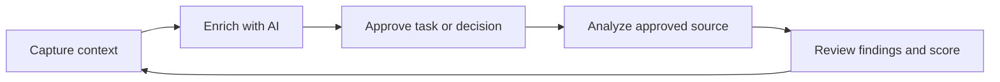

# Workspace Flow

> A project memory workspace for developers who need to preserve context, understand project health, and choose what to work on next.

[](./docs/README.md)
[](./docs/planning/phased-roadmap.md)
[](#project-status)

Workspace Flow connects the reasoning behind a project with the code that implements it. Users capture notes and architecture decisions, approve AI enrichment, connect a source with explicit consent, and receive read-only, evidence-backed health insights.

## Why Workspace Flow

Code records what changed. Workspace Flow records **why it changed**, what remains unresolved, and which project deserves attention now.

### Core Loop



## Product Scope

| Capability | MVP behavior |
| ---------- | ------------ |
| Project memory | Notes and architecture decisions linked to a project |
| AI enrichment | User-approved classification, task proposals, and decision structuring |
| Contextual work | Tasks retain their originating note through `source_note_id` |
| Project diagnosis | Read-only analysis of an approved GitHub repository or local folder |
| Health scoring | Five dimensions with visible weights, findings, and trends |
| Privacy | BYOK credentials, explicit source consent, and no source-code retention |

## Agent Stack

| Layer | Technology | Responsibility |
| ----- | ---------- | -------------- |
| Orchestration | [LangGraph](./docs/architecture/agents.md) | Agent workflow, state, checkpoints, and retries |
| Repository analysis | [Tree-sitter](./docs/architecture/agents.md) | Language-aware project inventory and parsing |
| Contracts | [Pydantic](./docs/architecture/agents.md) | Typed state and validated agent output |
| Model execution | Gemini/Groq adapters | BYOK inference behind a provider interface |
| Source access | File System Access API and GitHub adapter | Scoped, read-only source inspection |

The complete agent catalog, permissions, workflow, error handling, and Definition of Done are documented in [docs/architecture/agents.md](./docs/architecture/agents.md).

## Architecture at a Glance

```text
React + TypeScript
	|
	v
FastAPI application layer
	|
	+--> Project memory and contextual work
	+--> Consent and source adapters
	+--> LangGraph diagnosis workflow
		    |
		    +--> Tree-sitter inventory
		    +--> Architecture / Quality / Security agents
		    +--> Findings correlation
		    +--> Explainable score
	|
	v
PostgreSQL
```

## Documentation

Start with the [documentation hub](./docs/README.md), then follow the path that matches your role:

- [Product Definition](./docs/product-definition.md) - problem, boundaries, use cases, agents, and scoring
- [Executive Summary](./docs/executive-summary.md) - vision, objectives, MVP scope, and mockups
- [Functional Requirements](./docs/requirements/functional-requirements.md) - product behavior and acceptance boundaries
- [Non-Functional Requirements](./docs/requirements/non-functional-requirements.md) - security, privacy, reliability, and agent safety
- [Agent Documentation](./docs/architecture/agents.md) - agent catalog and execution contract
- [Technical Architecture](./docs/architecture/technical-architecture.md) - layers, entities, providers, and orchestration
- [Phased Roadmap](./docs/planning/phased-roadmap.md) - phases, effort, deliverables, and Definition of Done
- [Epics and User Stories](./docs/user-stories/epics-and-user-stories.md) - MVP backlog with story points
- [Workspace Flow Mockups](./docs/ui-ux/prototypes/images/) - current visual references

## Base Mockups

The visual baseline is stored in [docs/ui-ux/prototypes/images/](./docs/ui-ux/prototypes/images/): [1.png](./docs/ui-ux/prototypes/images/1.png), [2.png](./docs/ui-ux/prototypes/images/2.png), [3.png](./docs/ui-ux/prototypes/images/3.png), [4.png](./docs/ui-ux/prototypes/images/4.png), [home.png](./docs/ui-ux/prototypes/images/home.png), and [screen.png](./docs/ui-ux/prototypes/images/screen.png).

## Project Status

- **Product definition**: Complete for team review
- **Architecture decisions**: Resolved for MVP
- **MVP estimate**: 209 story points across 8 two-week sprints
- **Implementation status**: Documentation and planning phase
- **License**: To be defined

## Repository Structure

```text
.
├── README.md
├── docs/
│   ├── architecture/
│   ├── planning/
│   ├── requirements/
│   ├── ui-ux/prototypes/images/
│   └── user-stories/
└── docs/product-definition.md
```

## Contributing to the Documentation

1. Start from the relevant product or technical document.
2. Preserve the existing Markdown structure and terminology.
3. Keep MVP decisions traceable to a requirement, story, or acceptance criterion.
4. Run `git diff --check` before opening a pull request.

---

**Version**: 2.0
**Last Updated**: August 26, 2026
