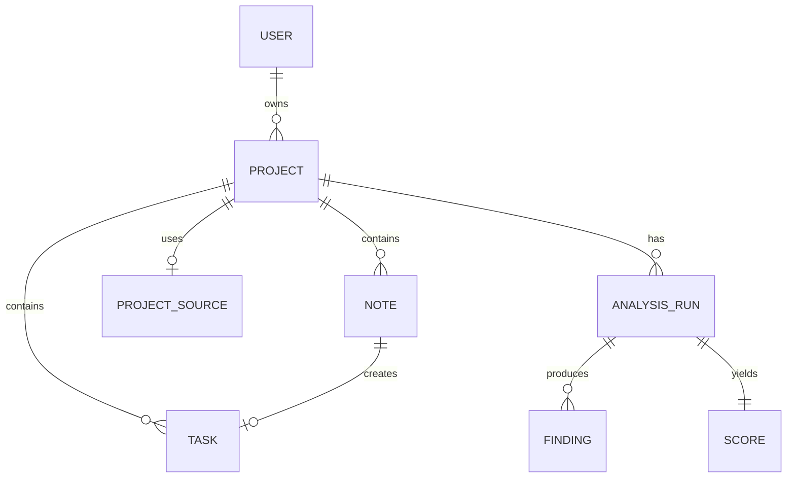

# Workspace Flow Product Definition

> **Status:** Draft 2.0 for team review  
> **Date:** August 26, 2026  
> **Replaces:** The previous generic task-manager proposal

Workspace Flow is a project-centered workspace that preserves technical context, turns ideas into actionable work, and diagnoses project health. It is not a general-purpose task manager: tasks are useful because they emerge from project memory.

---

## Table of Contents

1. [The Need](#1-the-need)
2. [What It Is and Is Not](#2-what-it-is-and-is-not)
3. [Target Users](#3-target-users)
4. [Use Cases](#4-use-cases)
5. [Domain Model](#5-domain-model)
6. [The Agents](#6-the-agents)
7. [The Health Score](#7-the-health-score)
8. [Functional Requirements](#8-functional-requirements)
9. [Non-Functional Requirements](#9-non-functional-requirements)
10. [Epics and User Stories](#10-epics-and-user-stories)
11. [Phased Roadmap](#11-phased-roadmap)
12. [Success Metrics](#12-success-metrics)
13. [Risks and Mitigations](#13-risks-and-mitigations)
14. [Assumptions and Open Questions](#14-assumptions-and-open-questions)
15. [Architecture Decisions](#15-architecture-decisions)
16. [Glossary](#16-glossary)
17. [Appendices](#appendices)

---

## 1. The Need

### 1.1 The Problem in One Sentence

> **A project's code survives; the reasoning behind it does not.**

Git preserves changes, task tools preserve status, and editor assistants preserve current-file context. None preserves decisions, unfinished thoughts, deliberate trade-offs, and current health in one durable place.

### 1.2 The Proposal

Workspace Flow combines project memory with read-only diagnosis. Users capture notes and decisions, approve AI enrichment, connect a source with consent, and receive evidence-backed findings and an explainable health score.

### 1.3 Product Principles

- Preserve original context and make every transformation traceable.
- Keep agents read-only and recommendations explainable.
- Request explicit consent before reading or transmitting source code.
- Prioritize a focused single-user workflow before collaboration features.

[Back to top](#table-of-contents)

---

## 2. What It Is and Is Not

| It Is | It Is Not |
| ----- | --------- |
| A memory workspace for each project | A general knowledge wiki |
| A read-only project health diagnosis | A CI/CD quality gate |
| A recommendation and prioritization layer | An agent that modifies code |
| Work that emerges from project context | A replacement for Jira or GitHub |
| A multi-project view for one user | A real-time collaboration suite |

### 2.1 Explicit Boundaries

Agents do not write during Phases 0-3. Source access is consented, visible, auditable, and revocable. The MVP uses one owner per project; sharing and roles are future decisions.

[Back to top](#table-of-contents)

---

## 3. Target Users

### 3.1 Primary User: The Multi-Project Developer

A developer with several active, dormant, or experimental projects who needs to resume work quickly and decide which project needs attention.

### 3.2 Secondary User: The Technical Lead

A technical lead who needs evidence-based comparison across repositories and a durable record of architectural trade-offs.

### 3.3 Not the Initial User

Large teams with formal collaboration and governance suites are outside the initial focus. Non-technical stakeholders without a source-diagnosis need will not receive the core value of the product.

[Back to top](#table-of-contents)

---

## 4. Use Cases

### UC-1: Resume a Dormant Project

Open a project and see activity, decisions, open contextual tasks, and the latest score without searching the repository.

### UC-2: Capture an Idea Without Friction

Write a free-form note, then accept, edit, or discard its AI classification.

### UC-3: Convert Memory into Work

Accept a note as a task while preserving `source_note_id`.

### UC-4: Diagnose a Project

Grant source consent, run analysis, and review score, dimensions, findings, evidence, and recommendations.

### UC-5: Prioritize Across Projects

Compare scores and trends, open the riskiest project, and choose the next action using evidence.

[Back to top](#table-of-contents)

---

## 5. Domain Model

See [Technical Architecture](./architecture/technical-architecture.md) for entity and persistence details.

[Back to top](#table-of-contents)

---

## 6. The Agents

Agents provide note enrichment and source diagnosis. They are orchestrated by LangGraph, return structured reviewable output, and never change project files. See [Agent Documentation](./architecture/agents.md) for the complete catalog, tools, permissions, workflow, and error handling.

### Agent Catalog

| Agent | Responsibility | Inputs | Outputs | MVP Phase |
| ----- | -------------- | ------ | ------- | --------- |
| Context Classifier | Classify a raw note and identify intent | Note content, project metadata | Note type, confidence, suggested title, rationale | Phase 1 |
| Task Proposal Agent | Turn actionable context into a draft task | Note, accepted classification | Task title, description, priority, acceptance criteria | Phase 1 |
| Decision Structuring Agent | Structure an architecture decision | Note, project context | Decision title, context, decision, alternatives, consequences | Phase 1 |
| Repository Inventory Agent | Establish project shape before diagnosis | Approved source, consent scope | Languages, frameworks, modules, entry points, evidence map | Phase 2 |
| Architecture Agent | Inspect structural risks and boundaries | Inventory, source, recorded decisions | Architecture findings with locations and recommendations | Phase 2 |
| Quality Agent | Inspect tests, documentation, and maintainability signals | Inventory, source, project memory | Quality findings with evidence and severity | Phase 2 |
| Security Agent | Identify security posture risks | Approved source, configuration metadata | Security findings with evidence and remediation guidance | Phase 2 |
| Findings Correlation Agent | Compare findings with project memory | Findings, notes, architecture decisions | Confirmed, contextualized, or decision-aware findings | Phase 2 |
| Score Aggregator | Calculate a reproducible health score | Validated findings, dimension weights | Overall score, dimension scores, score explanation | Phase 2 |

### Agent Technology Stack

- **LangGraph**: Agent workflow orchestration, state management, checkpoints, and retry paths.
- **Pydantic**: Typed state and validated agent outputs.
- **Tree-sitter**: Language-aware repository inventory before specialist analysis.
- **Gemini/Groq adapters**: Model execution using the user's BYOK credentials.
- **Read-only tools**: Scoped directory listing, file reading, parsing, and project metadata inspection.

### Agent Execution Rules

- The orchestration layer runs inventory before specialized diagnosis agents.
- Specialized agents may read only the source scope granted for the analysis run.
- The correlation agent may contextualize a finding but may not suppress evidence silently.
- The score aggregator consumes validated findings only; it does not invent findings.
- Every agent request and response is associated with an analysis run and correlation ID.
- A failed agent produces a visible partial-result state and never destroys prior project memory.

### Agent Rules

- Read only explicitly authorized source and project memory.
- Return evidence, confidence, and recommendation metadata.
- Identify relevant architecture decisions instead of treating every deviation as a defect.
- Fail visibly and preserve memory when a provider is unavailable.

[Back to top](#table-of-contents)

---

## 7. The Health Score

The score summarizes documented dimensions such as architecture, maintainability, testing, security posture, documentation, and delivery risk. Weights and supporting findings remain visible.

### Initial Score Model

| Dimension | Weight | Example Evidence |
| --------- | ------ | ----------------- |
| Architecture | 20% | Coupling, module boundaries, dependency direction |
| Maintainability | 20% | Complexity, duplication, code organization |
| Testing | 20% | Test presence, coverage signals, testability |
| Security | 20% | Secrets, unsafe configuration, dependency signals |
| Documentation and Delivery | 20% | Setup docs, runbooks, CI, operational clarity |

The initial score is a weighted value from 0 to 100. A score must always be accompanied by its dimension breakdown, finding count, analysis timestamp, and calculation version.

- Scores derive from immutable analysis results.
- Trends compare completed runs for the same project.
- Users can inspect findings responsible for a score change.
- The score is a prioritization signal, not an absolute quality claim.

[Back to top](#table-of-contents)

---

## 8. Functional Requirements

See [Functional Requirements](./requirements/functional-requirements.md).

---

## 9. Non-Functional Requirements

Workspace Flow must protect source privacy, enforce ownership, remain observable during analysis, support accessible responsive workflows, and preserve immutable analysis history. See [Non-Functional Requirements](./requirements/non-functional-requirements.md).

---

## 10. Epics and User Stories

The MVP is organized into Identity and Ownership, Project Workspace, Memory and Contextual Work, and Diagnosis and Reporting. See [Epics & User Stories](./user-stories/epics-and-user-stories.md).

---

## 11. Phased Roadmap

See [Phased Roadmap](./planning/phased-roadmap.md).

---

## 12. Success Metrics

See [Success Metrics](./metrics/success-metrics.md).

---

## 13. Risks and Mitigations

The principal risks are unauthorized source disclosure, generic findings, untrusted scores, analysis cost, and scope drift. Mitigations are explicit consent, required evidence, visible weights, usage controls, and strict product boundaries.

---

## 14. Assumptions and Open Questions

See [Open Questions & Assumptions](./open-questions.md).

---

## 15. Architecture Decisions

The following decisions are resolved for the MVP and must be treated as implementation constraints:

- **AI providers**: Use a multi-provider adapter architecture with BYOK credentials. Gemini is the default provider and Groq is the fast alternative; OpenAI and Anthropic remain extensibility options.
- **Local source access**: Use the browser File System Access API. Users explicitly select a directory, only whitelisted extensions are scanned, and excluded paths such as `.git`, `node_modules`, `.env*`, `dist`, and `build` are ignored.
- **Health scoring**: Use five fixed dimensions weighted at 20% each: Architecture, Code Quality, Testing & Reliability, Security & Safety, and Documentation & Delivery. Severity deductions are `CRITICAL -15`, `HIGH -8`, `MEDIUM -4`, and `LOW -2`, with scores clamped to 0-100.
- **Retention**: Store findings, textual evidence, locations, snapshot hashes, and score metadata. Do not persist source files, code snippets, binaries, or compiled artifacts.
- **Collaboration**: Shared projects and roles are deferred until after MVP validation.
- **Agent write capability**: Agents cannot write code, create commits, or open pull requests. A future documentation assistant may generate a draft Markdown note or changelog from approved project data, but the user must review and approve it before saving.

See [Open Questions & Decisions](./open-questions.md) and [Technical Architecture](./architecture/technical-architecture.md) for the implementation record.

---

## 16. Glossary

- **Project memory**: Notes, ideas, and decisions retained against a project.
- **Contextual task**: Work created from project memory with a source-note relationship.
- **Analysis run**: One diagnosis attempt against an approved source.
- **Finding**: An evidence-backed observation with severity and recommendation.
- **Health score**: A weighted, explainable summary of project condition.

---

## Appendices

### Appendix A: Base Mockups

The Workspace Flow mockups [`ui-ux/prototypes/images/1.png`](./ui-ux/prototypes/images/1.png), [`ui-ux/prototypes/images/2.png`](./ui-ux/prototypes/images/2.png), [`ui-ux/prototypes/images/3.png`](./ui-ux/prototypes/images/3.png), [`ui-ux/prototypes/images/4.png`](./ui-ux/prototypes/images/4.png), [`ui-ux/prototypes/images/home.png`](./ui-ux/prototypes/images/home.png), and [`ui-ux/prototypes/images/screen.png`](./ui-ux/prototypes/images/screen.png) define the visual baseline for authentication, project navigation, workspace detail, and diagnosis-oriented views.

### Appendix B: Related Documentation

- [Architecture](./architecture/technical-architecture.md)
- [Requirements](./requirements/functional-requirements.md)
- [Roadmap](./planning/phased-roadmap.md)
- [UI/UX Guidelines](./projects/frontend/prototype/ui-ux-guidelines.md)

---

**Version**: 2.0  
**Date**: August 26, 2026  
**Status**: Draft for Review  
**Maintained by**: Workspace Flow Team